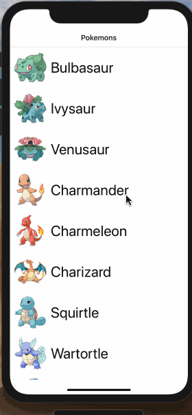

# GraphQL Client



### 1. Start the server

To start first clone and run the server

```
git clone git@github.com:calitb/GraphQL-Apollo-Server.git
cd GraphQL-Apollo-Server/
npm i
npm start
```

### 2. Start the application

```
npm i
npm run pods
npm run ios
```

### 3. Select the demo to run:

There are 3 demos to run, you can switch between them by opening `./components/routes.tsx` and edit the last line.

1. Demo1: Application showing mockup data in a ScrollView
2. Demo2: Application showing mockup data using a FlatList ( for memory improvements )
3. Demo3: Application using ApolloClient to fetch data from a server.

   You can open `./graphql/apollo` and set the `GRAPHQL_URL` value to point to your own server (See `Start the server` above).
